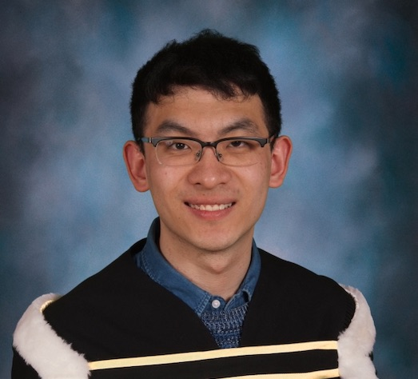

I am a first year Ph.D. computer science student at <a href="https://www.utoronto.ca">University of Toronto</a> working with Professor [Yang Xu](http://www.cs.toronto.edu/~yangxu/index.html) in the [Computational Linguistics Group](http://www.cs.toronto.edu/compling/index.html). My research interest lies at the intersection of Natural Language Processing, Cognitive Science and Machine Learning.

In particular, my current research involves building data-driven computational models that support inference and generation of innovative language uses, including novel word compounds and syntactic compositions. My research methods draw on multimodal knowledge, deep learning, and cognitive theories of categorization. This line of research has the potential application of constructing more human-like NLP systems for figurative language uses such as metaphor and metonymy. 

Before coming to Toronto, I spent three years as an undergraduate at [McGill University](https://www.mcgill.ca), Montreal, where I worked with [Prof. Jackie Cheung](https://www.cs.mcgill.ca/~jcheung/index.html), [Prof. Timothy O'Donnell](http://people.linguistics.mcgill.ca/~timothy.odonnell/), and [Prof. Thomas Shultz](https://www.tomshultz.net) on NLP and cognitive science research projects.

Contact: jadeleiyu [at] cs [dot] toronto [dot] edu

